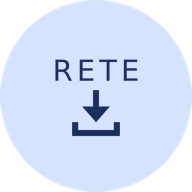
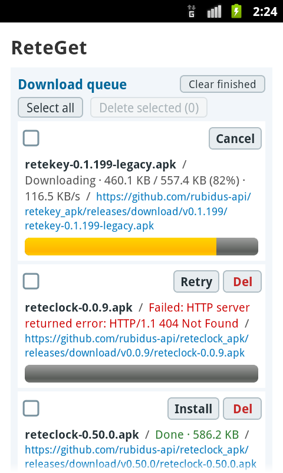
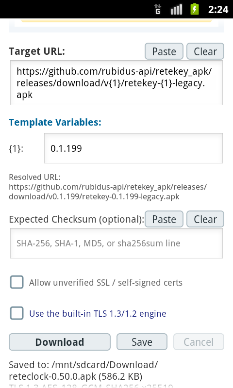
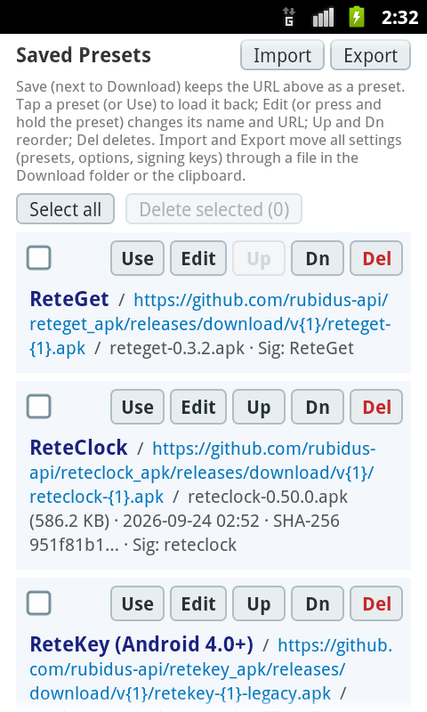

# ReteGet

**ReteGet v0.3.3** (최신 릴리즈) 다운로드 — [apk (안드로이드 2.3+)](https://github.com/rubidus-api/reteget_apk/releases/download/v0.3.3/reteget-0.3.3.apk) · [릴리즈 노트](https://github.com/rubidus-api/reteget_apk/releases/tag/v0.3.3)

[English](README.md) · **한국어**

**구형 안드로이드 기기(Android 2.3 Gingerbread ~ Android 4.x KitKat 이상)를 위한 독립형 초경량 파일 및 APK 다운로더.**

PC나 ADB 연결, 무거운 현대 앱 스토어 없이도 구형 기기에서 직접 APK, 펌웨어, 패키지 파일을 다운로드하고 설치할 수 있습니다.

<p align="center">
  
  &nbsp;&nbsp;&nbsp;
  
  <br>
  <sub>앱 아이콘: 일반판, 모노크롬판(안드로이드 13 이상 테마 아이콘)</sub>
</p>

<p align="center">
  
  &nbsp;&nbsp;
  
  &nbsp;&nbsp;
  
</p>

---

## 해결하려는 문제

구형 안드로이드 스마트폰이나 태블릿(Android 2.3 ~ 4.4)은 여전히 작동 가능한 하드웨어임에도 현대 웹 생태계와 거의 단절되어 있습니다:

1. **오래된 TLS 스택 및 만료된 루트 인증서**: GitHub을 비롯한 현대 웹 호스트는 TLS 1.2+ 및 SNI(Server Name Indication)를 엄격히 요구합니다. Android 2.3~4.0은 시스템 상 TLS 1.2를 지원하지 않으며, Android 4.1~4.4는 기본 소켓 팩토리에서 TLS 1.2가 꺼져 있습니다. 게다가 기기 내장 루트 인증서(IdenTrust DST Root CA X3 등)가 2021년 9월 만료되어 거의 모든 HTTPS 사이트에서 SSL 핸드셰이크 오류가 발생합니다.
2. **먹통이 된 내장 브라우저**: 초기 WebView나 순정 AOSP 브라우저는 현대 자바스크립트로 가득 찬 릴리즈 페이지(GitHub 등)를 열지 못하고 튕기거나 멈춥니다.
3. **사용 불가한 공식 앱 마켓**: Google Play 스토어는 이미 Android 4.x 이하 지원을 중단했습니다. 현대 오픈소스 마켓(F-Droid 등) 역시 수십 MB짜리 최신 라이브러리(Jetpack/AndroidX)에 의존하여 구형 기기에서는 실행조차 되지 않습니다.

## ReteGet이 하는 일

ReteGet은 외부 프레임워크 없는 순수 프레임워크 기반 안드로이드 유틸리티로, 구형 기기에서 네트워크를 통해 파일을 직접 가져오고 앱을 업데이트할 수 있게 합니다:

- **모던 TLS 1.2 강제 활성화 및 최신 Root CA 번들 탑재**: 소켓 생성 계층을 감싸 Android 4.x에서 TLS 1.2를 강제로 켜고 리플렉션을 통해 SNI를 주입합니다. 최신 주요 루트 인증서(Let's Encrypt의 ISRG Root X1, DigiCert Global Root CA/G2, USERTrust, Google Trust Services)를 앱 내부에 번들하여 최신 GitHub 릴리즈나 CDN 호스트로부터의 HTTPS 다운로드를 성공시킵니다.
- **내장 TLS 1.3 / 1.2 엔진 (안드로이드 2.3에서도 동작)**: 안드로이드 2.3~4.x는 스스로는 GitHub에 접속하지 못합니다. 2.3에는 TLS 1.2가 아예 없고, 갤럭시 노트 2 같은 4.1 기기는 `SSLv3 alert handshake failure`로 실패합니다. ReteGet은 순수 Java로 작성한 자체 TLS 클라이언트를 내장합니다: TLS 1.3(RFC 8446, X25519 또는 P-256 키 교환, AES-128-GCM, ECDSA / RSA-PSS 서버 서명)을 쓰고, TLS 1.3이 없는 서버에만 TLS 1.2(ECDHE + AES-GCM, Extended Master Secret)로 내려가며 다운그레이드 공격을 막습니다. 안드로이드 2.3은 GitHub의 ECDSA 인증서를 검증하지 못하므로 X25519, AES-GCM, HKDF, ECDSA, RSA-PSS, X.509 해석과 인증서 경로 검증까지 앱이 직접 합니다. 서버 인증서 체인과 호스트 이름은 시스템 및 내장 루트 인증서로 항상 확인합니다. 시스템 TLS가 실패하면 자동으로, 체크박스를 켜면 항상 이 엔진을 씁니다. RFC 8448 핸드셰이크 기록과 바이트 단위로 대조하고 독립적인 TLS 서버들과 시험했으며, 안드로이드 2.3.7에서 GitHub 릴리즈 다운로드로 확인했습니다.
- **화면 맨 위의 다운로드 큐**: 모든 다운로드는 화면 맨 위에 보이는 큐에 들어가며, 구형 기기에 무리가 가지 않도록 한 번에 하나씩 받습니다. 항목마다 파일 이름, 상태, 주소가 표시되고 받는 동안에는 그 아래에 진행 막대가 나옵니다. 실패한 항목은 이유가 표시되며 다시 시도하거나 지울 수 있고, 완료된 항목은 설치하거나(다운로드 직후와 같은 체크섬·서명 키 경고를 거침) 기록을 지울 수 있습니다(파일은 남습니다). 제목 아래의 **Select all**과 **Delete selected**로 여러 항목을 한꺼번에 지울 수 있습니다. 목록은 앱을 닫아도 유지되고, 그렇게 중단된 항목은 실패로 표시되어 다시 시도할 수 있습니다.
- **순수 HTTP 및 패시브 FTP 지원**: 가정 내 홈 서버나 사내 인트라넷 망에서 간편히 앱을 배포할 수 있도록 일반 HTTP와 의존성 제로 순수 Java 소켓 기반 RFC 959 패시브 모드 FTP 다운로드를 지원합니다.
- **릴리즈 URL 템플릿 지원 (`{1}`, `{2}`, `{version}`)**: 다운로드 주소에 포함된 괄호형 플레이스홀더(예: `https://github.com/user/repo/releases/download/v{1}/app-{1}.apk`)를 자동으로 감지합니다. 템플릿이 인식되면 작은 입력창을 화면에 띄워, 긴 주소를 매번 다시 입력할 필요 없이 버전 번호만 넣으면 완성된 주소로 다운로드합니다.
- **체크섬 및 무결성 해시 검증**: GitHub, GitLab 및 오픈소스 생태계에서 널리 쓰이는 **SHA-256**, **SHA-1**, **MD5**, **SHA-512** 해시 검증을 지원합니다. 순수 16진수 값, `sha256: <해시>`, 또는 리눅스 `sha256sum` 명령 출력 형식(`<해시>  <파일명>`)을 그대로 복사해서 붙여넣어도 자동으로 알고리즘을 감지하여 파일을 대조합니다. 일치 시 안전한 설치를 돕고, 불일치 시 설치 전 경고를 띄워 위변조 및 다운로드 손상을 방지하며, 계산된 해시값을 원터치로 복사할 수 있습니다.
- **APK 서명 및 제작자 연속성 검증**: 다운로드된 APK의 X.509 서명 인증서를 추출하고 SHA-256 지문을 계산합니다. 기기에 이미 설치된 앱과의 서명 충돌(`INSTALL_FAILED_UPDATE_INCOMPATIBLE`)을 사전 감지하고, 이전 다운로드 이력(TOFU 모델)과 대조하여 제작자 키 교체 여부를 경고합니다. 불일치 시 상세 내역과 함께 설치 취소 또는 무시하고 진행할 수 있는 선택형 경고 다이얼로그를 제공합니다.
- **rete 시리즈 프리셋 기본 내장**: ReteGet, ReteClock, ReteKey(안드로이드 4.0+용, 그리고 안드로이드 9+용)가 GitHub 릴리즈용 버전 템플릿으로 들어 있고, 예상 SHA-256과 서명 키도 미리 채워져 있습니다. 기본 목록이 갱신되어도 직접 추가한 프리셋은 그대로 남습니다.
- **프리셋 이름 지정 및 다운로드 이력 관리**: 프리셋마다 이름(예: *ReteGet*, *ReteClock*)을 붙여 템플릿 주소끼리 쉽게 구분합니다. *Download* 옆의 **Save**는 위 주소를 프리셋으로 남깁니다. 각 프리셋은 이름, 주소, 마지막 다운로드 기록을 한 문단으로 이어 보여 주고, 윗줄의 짧은 버튼으로 다룹니다: **Use**(또는 항목 누르기)는 알려진 버전을 채워 주소창으로 불러오고, **Edit**(또는 길게 누르기)는 이름과 주소를 바꾸고, **Up**/**Dn**은 순서를 바꾸고, **Del**은 지웁니다. **Select all**과 **Delete selected**는 체크한 프리셋에 작동합니다.
- **설정 내보내기·가져오기**: **Export**는 모든 설정(프리셋, 옵션, 앱별로 본 서명 키)을 다운로드 폴더의 `reteget-settings-<날짜>.ini`에 쓰고 같은 내용을 클립보드로 복사할 수도 있습니다. **Import**는 그런 파일이나 클립보드를 읽어 무엇이 바뀌는지 보여 준 뒤 병합합니다: 프리셋은 주소로 맞추고, 이 폰에만 있는 프리셋은 남고, 이 폰에 이미 기록된 서명 키는 절대 바뀌지 않습니다. 파일은 INI와 TOML이 똑같이 읽는 부분집합(rete 시리즈의 설정 형식)의 평문이라 사람이 읽고 고칠 수 있습니다.
- **붙여넣기와 지우기**: *Target URL*과 *Expected Checksum* 옆의 **Paste**는 클립보드의 내용을 넣고 **Clear**는 칸을 비웁니다.
- **기본 다운로드 폴더에 저장**: 파일은 시스템의 기본 다운로드 폴더에 저장됩니다(안드로이드 2.3에서는 `/mnt/sdcard/Download`. 여기서 "sdcard"는 카드 슬롯이 없는 폰에서도 쓰는 공용 저장소의 이름입니다). 공용 저장소가 없거나 사용 중이면(예: USB로 PC에 연결된 동안) 앱 전용 저장소에 대신 저장하고 알려 주며, 그곳에서도 APK를 설치할 수 있습니다.
- **원터치 APK 설치 연동**: `.apk` 파일 다운로드가 끝나면 즉시 시스템 패키지 인스톨러(`Intent.ACTION_VIEW` - `application/vnd.android.package-archive`) 호출 다이얼로그를 띄워 한 번의 탭으로 설치 화면으로 진입합니다.
- **자체 서명 / 사설 SSL 우회 체크박스**: 홈랩이나 사내 테스트 서버의 자체 서명 인증서 환경을 위해 인증서 검증을 건너뛰는 옵션을 기본 제공합니다.
- **초경량 단일 Dex**: 최종 APK 크기 약 173 KB, 외부 라이브러리 제로, 무거운 Gradle 없이 단일 덱스로 빌드됩니다.

## 대상 플랫폼 및 호환성

- **최소 SDK**: Android 2.3 Gingerbread (API 9 / 10)
- **주요 호환성 기준선**: Android 4.4 KitKat (API 19)
- **타겟 SDK**: Android 9.0 Pie (API 28)
- **아키텍처**: 단일 Dex 순수 Java 바이트코드.

## 빌드 및 설치

Android SDK 기본 커맨드라인 도구(`aapt2`, `javac`, `d8`, `zipalign`, `apksigner`)만으로 빌드합니다 (Gradle 불필요):

```sh
scripts/build.sh              # dist/reteget-<버전>-debug.apk, 로컬 개발 키로 서명
scripts/build.sh --release    # dist/reteget-<버전>.apk, RETEGET_KEYSTORE 필요
scripts/build.sh --unsigned   # dist/reteget-<버전>-unsigned.apk, F-Droid가 서명하도록
scripts/test.sh               # 독립형 콘솔 러너로 코어 단위 테스트 실행
```

APK는 구형 기기를 위한 v1(JAR 서명)과 최신 기기를 위한 v2/v3 스키마로 동시 서명됩니다. 모든 빌드는 고정 타임스탬프(`TZ=UTC`, zip 에포크 고정)를 사용하여 어디서 빌드하든 동일한 바이너리가 생성되는 재현 가능한 빌드(reproducible build)를 지원합니다.

## 이름에 대하여

**rete**는 라틴어로 *그물*이라는 뜻이고, *-get*은 네트워크에서 무언가를 가져온다는 뜻입니다(유닉스의 `wget`이나 HTTP의 `GET` 메서드처럼요).

의도한 발음은 라틴어 그대로 **레이-테-겟**입니다(세 음절 `rē-te-get`. 첫 모음은 길게 늘인 *에이*이고, *rete*의 마지막 *e*는 묵음이 아니라 반드시 소리 내며, *-get*은 명쾌하게 닿소리로 맺습니다).

영어가 이 낱말을 다루는 방식대로 읽으셔도 좋습니다. 영어는 *rete*를 해부학 용어로 들여와 **리-티**로 읽으니, **리-티-겟**도 자연스럽고 훌륭한 읽기입니다. 편하신 대로 부르시면 됩니다. ReteGet은 묵묵히 파일을 가져올 뿐입니다.

## 라이선스

MIT. `LICENSE` 파일을 참고해 주십시오.
