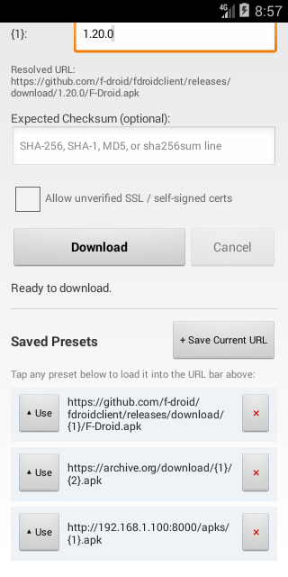

# ReteGet

**ReteGet v0.1.0** (latest release) download — [apk (Android 2.3+)](https://github.com/rubidus-api/reteget_apk/releases/download/v0.1.0/reteget-0.1.0.apk) · [release notes](https://github.com/rubidus-api/reteget_apk/releases/tag/v0.1.0)

**English** · [한국어](README.ko.md)

**A lightweight, standalone file and APK downloader for legacy Android devices (Android 2.3+ Gingerbread through Android 4.x KitKat and newer).**

Download APKs, firmware images, and files directly on vintage devices without needing a PC, ADB, or modern app stores.

<p align="center">
  
  &nbsp;&nbsp;
  
  &nbsp;&nbsp;
  
</p>

---

## The Problem

Legacy Android smartphones and tablets (Android 2.3 through 4.4) remain capable hardware, but they are almost entirely cut off from the modern web:

1. **Obsolete TLS & Expired Certificates**: Modern web hosts (including GitHub) strictly mandate TLS 1.2+ with Server Name Indication (SNI). Android 2.3–4.0 lack native TLS 1.2, and Android 4.1–4.4 have TLS 1.2 disabled by default in stock socket factories. Furthermore, system root certificates (such as IdenTrust DST Root CA X3) expired in September 2021, causing SSL handshake failures on almost every modern site.
2. **Broken Stock Browsers**: Early WebViews and stock AOSP browsers crash or hang on modern JavaScript-heavy release pages.
3. **Dead App Stores**: Google Play Store and modern app stores no longer connect or support devices below Android 5.0+. Modern open-source stores require multi-megabyte Jetpack/AndroidX runtimes that cannot install on legacy systems.

## What ReteGet Does

ReteGet is a dedicated, framework-only Android utility that bridges the gap, allowing vintage hardware to fetch files and install APK updates directly over the air:

- **Modern TLS 1.2 & Bundled Root CAs**: Wraps SSL socket creation to force-enable TLS 1.2 on Android 4.x with SNI reflection support. Bundles modern Root CAs (ISRG Root X1, DigiCert Global Root CA/G2, USERTrust, Google Trust Services) so downloads from modern GitHub Releases and CDN hosts succeed without warnings.
- **Pure-Java TLS 1.2 Engine (Galaxy Note 2 / Android 4.1 Fix)**: Vintage Android 4.1 Jelly Bean devices (such as the Samsung Galaxy Note 2) have a system OpenSSL stack that lacks modern AES-GCM cipher suites required by GitHub and modern CDNs, resulting in `SSLv3 alert handshake failure`. ReteGet embeds a lightweight pure-Java TLS 1.2 client (RFC 5246, NIST P-256 ECDHE with `BigInteger`, pure AES-128-GCM with GHASH, and SHA-256 PRF) using standard Java/crypto primitives without external libraries. It features automatic fallback on SSL handshake failures as well as an explicit UI toggle.
- **Direct HTTP & Passive FTP**: Supports plain HTTP and zero-dependency RFC 959 passive mode FTP for fast local network or intranet software distribution.
- **Release URL Templates (`{1}`, `{2}`, `{version}`)**: Detects bracketed placeholder tokens in download URLs (such as `https://github.com/user/repo/releases/download/v{1}/app-{1}.apk`). When present, ReteGet dynamically generates small input boxes so you only need to type the version number to fetch an update.
- **Checksum & Hash Integrity Verification**: Verifies downloaded files against industry-standard hashes widely used by GitHub, GitLab, and open-source distributions: **SHA-256**, **SHA-1**, **MD5**, and **SHA-512**. You can paste raw hex digests, `sha256: <hash>`, or standard GNU `sha256sum` output lines (`<hash>  <filename>`). Automatically detects the algorithm, warns of corruption or tampering before installation, and provides one-tap hash copying.
- **APK Signature & Author Continuity Verification**: Automatically inspects the X.509 signing certificate of downloaded APKs and calculates its SHA-256 fingerprint. Verifies continuity against currently installed packages (preventing `INSTALL_FAILED_UPDATE_INCOMPATIBLE` signature conflicts) and previous download history (TOFU model). If author signing keys change or conflict, a clear warning dialog is displayed with an option to inspect details and override.
- **Named Presets & History Management**: Assign human-readable names to presets (e.g. *ReteGet*, *ReteClock*, *ReteKey*) so distinct apps using template URLs are easily recognized. Manage presets with a two-field dialog (name + URL, `✎`), reordering (`↑`/`↓`), delete confirmation (`✕`), multi-selection checkboxes, and batch deletion. Tapping a preset loads it into the URL bar and automatically prefills known version numbers.
- **One-Touch APK Installation**: Once an `.apk` file finishes downloading to `/sdcard/Download`, ReteGet immediately prompts to launch the system package installer (`Intent.ACTION_VIEW` with MIME type `application/vnd.android.package-archive`).
- **Unverified SSL Bypass Option**: Includes an optional checkbox to allow unverified or self-signed certificates when downloading from local test servers or home labs.
- **Ultra-Lightweight & Single-Dex**: Under 87 KB APK size, single dex file, zero third-party libraries, and built without Gradle.

## Target Platform & Compatibility

- **Minimum SDK**: Android 2.3 Gingerbread (API 9 / 10)
- **Primary Compatibility Floor**: Android 4.4 KitKat (API 19)
- **Target SDK**: Android 9.0 Pie (API 28)
- **Architecture**: Single-dex pure Java bytecode.

## Build and Installation

Built entirely with Android SDK command-line tools (`aapt2`, `javac`, `d8`, `zipalign`, `apksigner`):

```sh
scripts/build.sh              # dist/reteget-<version>-debug.apk, signed with a local dev key
scripts/build.sh --release    # dist/reteget-<version>.apk, requires RETEGET_KEYSTORE
scripts/build.sh --unsigned   # dist/reteget-<version>-unsigned.apk, for F-Droid to sign
scripts/test.sh               # run unit tests with standalone Java runner
```

The APK is signed with v1 (JAR signing) plus v2 and v3 schemes, so Android 2.3 through 4.4 accept the v1 signature and modern Android accepts v2/v3. Builds are fully reproducible (`TZ=UTC`, fixed zip epoch timestamps).

## The name

**rete** is Latin for *net*, and *-get* is just to fetch or retrieve over the wire (drawing heritage from classic Unix `wget` and HTTP `GET`).

The intended pronunciation is the Latin one: **RAY-teh-get** (three syllables, `rē-te-get`; the first vowel is the long *e* of *they*, the middle *e* is pronounced, never silent, and *-get* snaps shut).

If you would rather say it the way English usually treats this word, that is fine too. English borrowed *rete* as an anatomical term and pronounces it **REE-tee**, so **REE-tee-get** is a perfectly natural reading. Say it however you like; ReteGet will just quietly fetch the file.

## License

MIT. See `LICENSE`.
